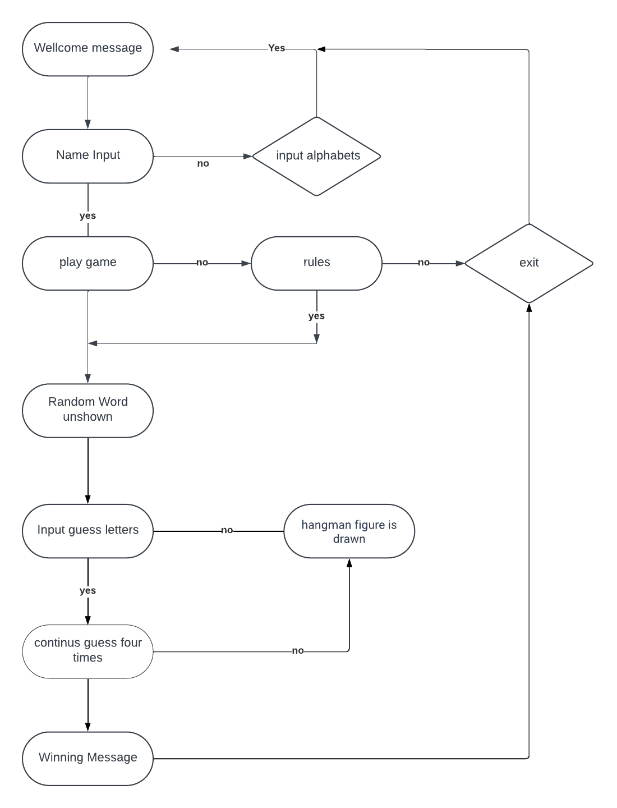
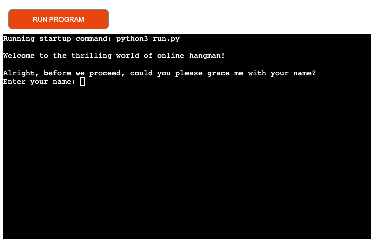
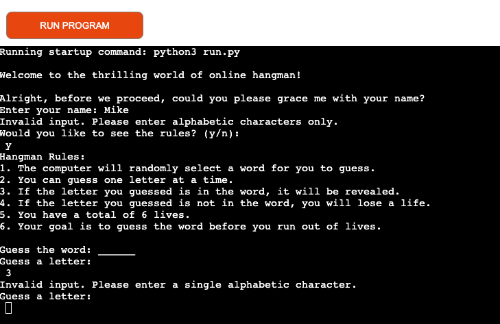
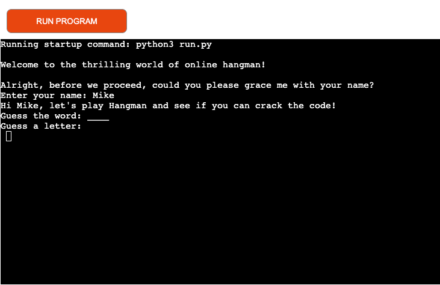
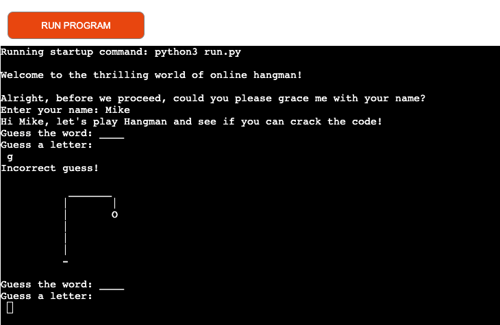
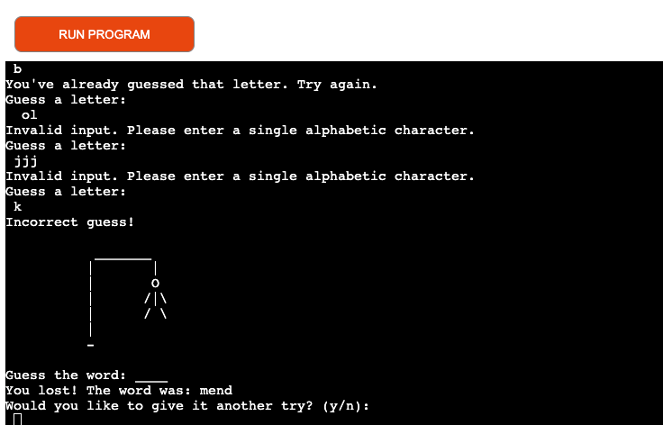
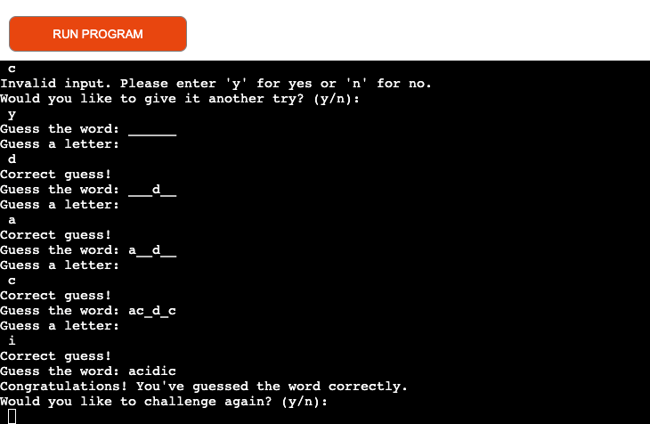

Online Hangman is an enjoyable game against the computer! This is where you'll try to guess a secret word, letter by letter, while the computer tries to do the same and every wrong letter draws the  hangman one step closer to his fate. 
 
 
 
 ## Purpose 
 
Entertainment: Hangman is primarily created as a source of fun and entertainment. It can be an engaging game that challenges players' word-guessing abilities and provides a recreational activity for individuals or groups.

Education: Hangman can be used as an educational tool to enhance language skills, particularly vocabulary, spelling, and word recognition. Teachers or language instructors might create Hangman games to make learning more interactive and enjoyable for students.
 
## How To play

* The game begin by greeting the user with a friendly message.
* Before the Game procceds it requests the user for their name.
* After the name it gives you the option of havin a look at the rule
* You are then provided with two options either to have a look at the rule book or  to start the game.
* You are then provided with two options either to have a look at the rule book or  to start the game.

  
### When you select to play 
1. You'll see a series of dashes on the screen, representing the letters of the word.
2. Guess one letter at a time by clicking or tapping on the corresponding letter on the on-screen or keyboard.
3. If the guessed letter is in the word,For example, if the word is "code" and you guess "c," the dashes will update to show "c _ _ _".
4. If the guessed letter is not in the word, you'll receive a notification, and one part of the hangman figure will be drawn. Be careful! You have a limited number of incorrect guesses before the hangman figure is completed.
6. Continue guessing letters until you either guess the entire word correctly or the hangman figure is fully drawn.
7. If you guess the word correctly before the hangman figure is completed, you win!
8. If the hangman figure is completed before you guess the word, you lose.
9. After the game ends, you may have the option to play again and try to beat your previous score.

   
## Visual Representations

### Technologies Used
* * Python
* * Github
* * Gitpod
* * Heroku
 
  

* The welcome message and name requirement are displayed.
  
 
* The option to view the rules or proceed to play the game
  

* A letter input is needed to determine the possible word
  

* If the input letter is not alphabetic then invalid data message.
  

* The picture of Hangman is drawn upon every incorrect guess.
  

* If you fail to attempt the word in 6 guess you lose.

* If you are smart to guess you Win.

 ## Testing

 
 I have manually tested this project by doing the following:
* Passed the code through a PEP8 and confirmed there are no problems.
Tested in my local terminal and the Code Institute Heroku terminal.

## Bugs

During the deployment process from GitHub to Heroku, I encountered a bug that caused the deployment to fail. The specific error message I received was: "<insert error message>". This issue prevented my application from being successfully deployed on Heroku.
After investigation, I realized that the 'nodels.js' module was not selected, causing the issue. Please make sure to include 'nodels.js' when deploying the code to Heroku to ensure proper functionality.

I encountered a bug while trying to display images in the README.md file. The images were not rendering correctly when using the Markdown syntax.Images were not being shown.After researching and reviewing the Markdown syntax, I discovered that the correct syntax for embedding images in Markdown is using the following format.

## Deployment

1. Sign up: Create an account on Heroku (if you don't have one already).
2. Create a new app: On Heroku, create a new app by clicking the "New" button and giving it a unique name.
3. Connect to GitHub: In the "Deploy" tab of your Heroku app, select the option to connect to your GitHub repository. Search for your repository and connect it to your Heroku app.
4. Configure deployment: Choose the branch you want to deploy from and configure any additional settings, such as automatic deployments on new commits.
5. Deploy: Click the "Deploy Branch" button to start the deployment process. Heroku will fetch the code from your GitHub repository and build your app.
6. Monitor deployment: Heroku will display the deployment progress, including any build errors or warnings. Make sure to review the logs and resolve any issues if necessary.
7. Open your app: Once the deployment is successful, you can open your app by clicking the "Open app" button in Heroku or using the provided URL.

## Credits 

[Stackoverflow](https://stackoverflow.com/questions/2084508/clear-terminal-in-python)
[Python For Everyone](https://www.youtube.com/@python-for-everyone)
